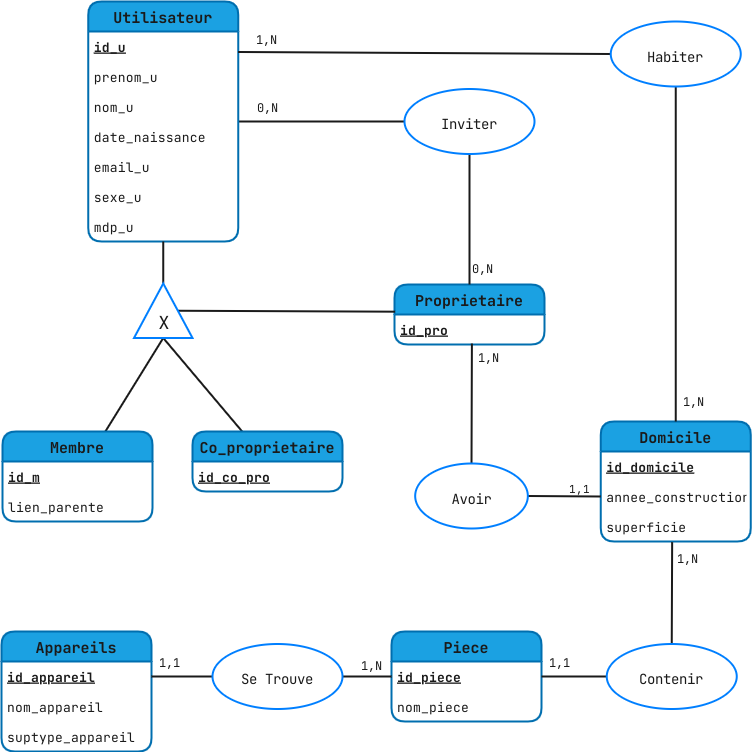
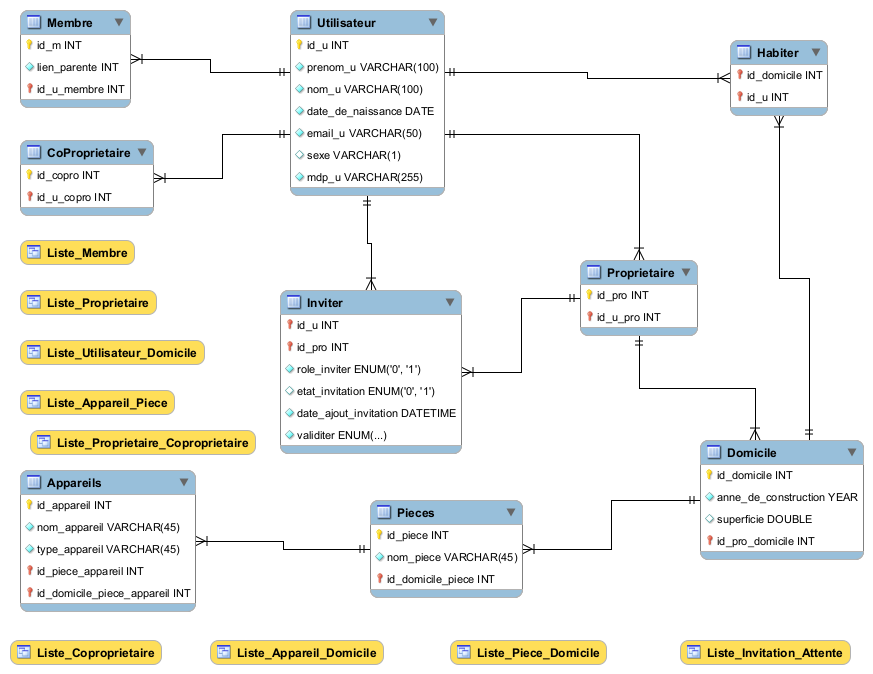

# Diagramme MCD




### MCD en MLD

```
Utilisateur (id_u, prenom_u, nom_u, email_u, date_de_naissance, mdp_u)

Membre (id_membre, lien_parente,#id_u)

Coproprietaire (id_copro,#id_u)

Proprietaire (id_prop,#id_u)

Domicile (id_domicile, annne_de_construction, superficie, #id_uProprietaire)

Appareil (id_appareil, nom_appareil, type_appareil, #id_piece)

Piece (id_piece, nom_piece, #id_domicile)

Inviter (#id_uUtilisateur, #id_uProprietaire)

Habiter (#id_uUtilisateur, #id_domicile)
```

# Diagramme EER



# SQL-script